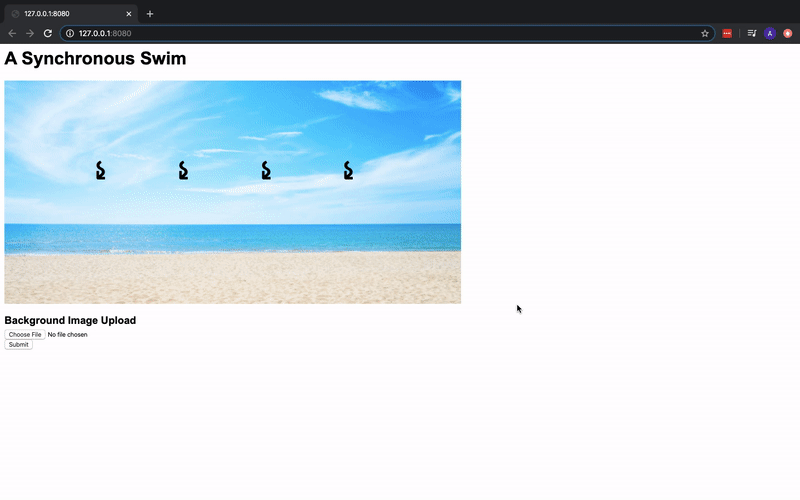

# a-synchronous-swim
This is a project I completed as a student at [hackreactor](http://hackreactor.com). This project was worked on with a pair.

## Technologies
- JavaScript
- jQuery
- Node
- Chai
- Jest

## Goals
- Gain more experience with asynchronous behaviors through the use of keyboard events and network events
- Achieve a deeper understanding of how client and server systems interact with each other through CORS, uploading of files, requests, and responses.
- Learn to write tests, use binary data, buffers, as well as reading and writing files to the hard drive.

